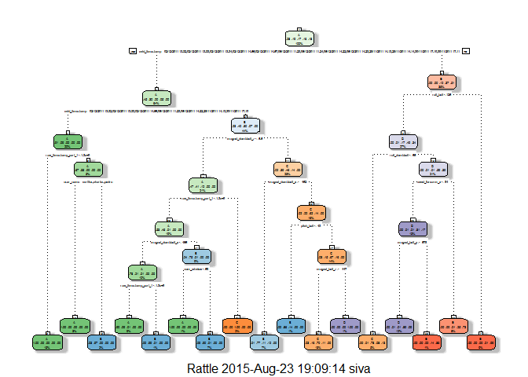

# Practical Machine Learning Prediction Project
Removed For Privacy [GitHub](https://github.com/vp44/pml)  


```
## Run time: 2015-08-23 19:08:38
## R version: R version 3.1.2 (2014-10-31)
```

# Prepare the datasets


```r
library(rpart)
library(rpart.plot)
```

```
## Warning: package 'rpart.plot' was built under R version 3.1.3
```

```r
library(RColorBrewer)
```

```
## Warning: package 'RColorBrewer' was built under R version 3.1.3
```

```r
library(rattle)
```

```
## Warning: package 'rattle' was built under R version 3.1.3
```

```
## Loading required package: RGtk2
```

```
## Warning: package 'RGtk2' was built under R version 3.1.3
```

```
## Rattle: A free graphical interface for data mining with R.
## Version 3.5.0 Copyright (c) 2006-2015 Togaware Pty Ltd.
## Type 'rattle()' to shake, rattle, and roll your data.
```

```r
library(caret)
```

```
## Warning: package 'caret' was built under R version 3.1.3
```

```
## Loading required package: lattice
## Loading required package: ggplot2
```

```
## Warning: package 'ggplot2' was built under R version 3.1.3
```

```r
library(randomForest)
```

```
## Warning: package 'randomForest' was built under R version 3.1.3
```

```
## randomForest 4.6-10
## Type rfNews() to see new features/changes/bug fixes.
```

Load the training and testing data into a data table.


```r
trainUrl <- "http://d396qusza40orc.cloudfront.net/predmachlearn/pml-training.csv"
testUrl <- "http://d396qusza40orc.cloudfront.net/predmachlearn/pml-testing.csv"
training <- read.csv(url(trainUrl), na.strings=c("NA","#DIV/0!",""))
testing <- read.csv(url(testUrl), na.strings=c("NA","#DIV/0!",""))
```

We are given an overwhelmingly large training data. We simply partition and generate a testing set rather than use only 20 observation in the given test set. Partition into training and testing is done with a 60/40 split in the code below. 

```r
inTrain <- createDataPartition(y=training$classe, p=0.6, list=FALSE)
myTraining <- training[inTrain, ]; myTesting <- training[-inTrain, ]
dim(myTraining); dim(myTesting)
```

```
## [1] 11776   160
```

```
## [1] 7846  160
```

Remove zero variance predictors

```r
myDataNZV <- nearZeroVar(myTraining, saveMetrics=TRUE)

myNZVvars <- names(myTraining) %in% row.names(myDataNZV[myDataNZV$nzv==TRUE,])
myTraining <- myTraining[!myNZVvars]
#To check the new N?? of observations
dim(myTraining)
```

```
## [1] 11776   130
```

We remove the first column of the data and also clean Variables with too many NAs. For Variables that have more than a 60% threshold of NA's we leave them out.


```r
myTraining <- myTraining[c(-1)]
trainingV3 <- myTraining #creating another subset to iterate in loop
for(i in 1:length(myTraining)) { #for every column in the training dataset
        if( sum( is.na( myTraining[, i] ) ) /nrow(myTraining) >= .6 ) { #if n?? NAs > 60% of total observations
        for(j in 1:length(trainingV3)) {
            if( length( grep(names(myTraining[i]), names(trainingV3)[j]) ) ==1)  { #if the columns are the same:
                trainingV3 <- trainingV3[ , -j] #Remove that column
            }   
        } 
    }
}
#To check the new N?? of observations
dim(trainingV3)
```

```
## [1] 11776    58
```


```r
#Seting back to our set:
myTraining <- trainingV3
rm(trainingV3)
```

Do the same for the testing set of variables (as well as the original testing set.)

```r
clean1 <- colnames(myTraining)
clean2 <- colnames(myTraining[, -58]) #already with classe column removed
myTesting <- myTesting[clean1]
testing <- testing[clean2]

#To check the new N?? of observations
dim(myTesting)
```

```
## [1] 7846   58
```


```r
dim(testing)
```

```
## [1] 20 57
```

Harmonize the type of test and training data. Otherwise RandomForest throws an error that "Predictors in the new data do not match that of the training data"

```r
for (i in 1:length(testing) ) {
        for(j in 1:length(myTraining)) {
        if( length( grep(names(myTraining[i]), names(testing)[j]) ) ==1)  {
            class(testing[j]) <- class(myTraining[i])
        }      
    }      
}
#And to make sure Coertion really worked, simple smart ass technique:
testing <- rbind(myTraining[2, -58] , testing) #note row 2 does not mean anything, this will be removed right.. now:
testing <- testing[-1,]
```
# Train a prediction model
We first use decision trees.

```r
modFitA1 <- rpart(classe ~ ., data=myTraining, method="class")
fancyRpartPlot(modFitA1)
```

 

We check how good the prediciton is

```r
predictionsA1 <- predict(modFitA1, myTesting, type = "class")
```

We look at the cross-tabulation of observed and predicted calsses with associated statistics.


```r
confusionMatrix(predictionsA1, myTesting$classe)
```

```
## Confusion Matrix and Statistics
## 
##           Reference
## Prediction    A    B    C    D    E
##          A 2153   68    7    1    0
##          B   57 1243   76   53    0
##          C   22  199 1256  132   58
##          D    0    8   16  877   72
##          E    0    0   13  223 1312
## 
## Overall Statistics
##                                           
##                Accuracy : 0.8719          
##                  95% CI : (0.8643, 0.8792)
##     No Information Rate : 0.2845          
##     P-Value [Acc > NIR] : < 2.2e-16       
##                                           
##                   Kappa : 0.8379          
##  Mcnemar's Test P-Value : NA              
## 
## Statistics by Class:
## 
##                      Class: A Class: B Class: C Class: D Class: E
## Sensitivity            0.9646   0.8188   0.9181   0.6820   0.9098
## Specificity            0.9865   0.9706   0.9366   0.9854   0.9631
## Pos Pred Value         0.9659   0.8698   0.7534   0.9013   0.8475
## Neg Pred Value         0.9859   0.9571   0.9819   0.9405   0.9794
## Prevalence             0.2845   0.1935   0.1744   0.1639   0.1838
## Detection Rate         0.2744   0.1584   0.1601   0.1118   0.1672
## Detection Prevalence   0.2841   0.1821   0.2125   0.1240   0.1973
## Balanced Accuracy      0.9755   0.8947   0.9273   0.8337   0.9365
```
Since accuracy is poor we try to use RandomForests


```r
modFitB1 <- randomForest(classe ~. , data=myTraining)
predictionsB1 <- predict(modFitB1, myTesting, type = "class")
confusionMatrix(predictionsB1, myTesting$classe)
```

```
## Confusion Matrix and Statistics
## 
##           Reference
## Prediction    A    B    C    D    E
##          A 2231    1    0    0    0
##          B    1 1517    3    0    0
##          C    0    0 1361    3    0
##          D    0    0    4 1282    0
##          E    0    0    0    1 1442
## 
## Overall Statistics
##                                           
##                Accuracy : 0.9983          
##                  95% CI : (0.9972, 0.9991)
##     No Information Rate : 0.2845          
##     P-Value [Acc > NIR] : < 2.2e-16       
##                                           
##                   Kappa : 0.9979          
##  Mcnemar's Test P-Value : NA              
## 
## Statistics by Class:
## 
##                      Class: A Class: B Class: C Class: D Class: E
## Sensitivity            0.9996   0.9993   0.9949   0.9969   1.0000
## Specificity            0.9998   0.9994   0.9995   0.9994   0.9998
## Pos Pred Value         0.9996   0.9974   0.9978   0.9969   0.9993
## Neg Pred Value         0.9998   0.9998   0.9989   0.9994   1.0000
## Prevalence             0.2845   0.1935   0.1744   0.1639   0.1838
## Detection Rate         0.2843   0.1933   0.1735   0.1634   0.1838
## Detection Prevalence   0.2845   0.1939   0.1738   0.1639   0.1839
## Balanced Accuracy      0.9997   0.9994   0.9972   0.9981   0.9999
```

We obtain much better accuracy and pick this model. The estimated out of sample error is <0.3%

#Generate the files for submission.

We use the randome forest model to generate the required files.


```r
predictionsB2 <- predict(modFitB1, testing, type = "class")

pml_write_files = function(x){
  n = length(x)
  for(i in 1:n){
    filename = paste0("problem_id_",i,".txt")
    write.table(x[i],file=filename,quote=FALSE,row.names=FALSE,col.names=FALSE)
  }
}

pml_write_files(predictionsB2)
```

